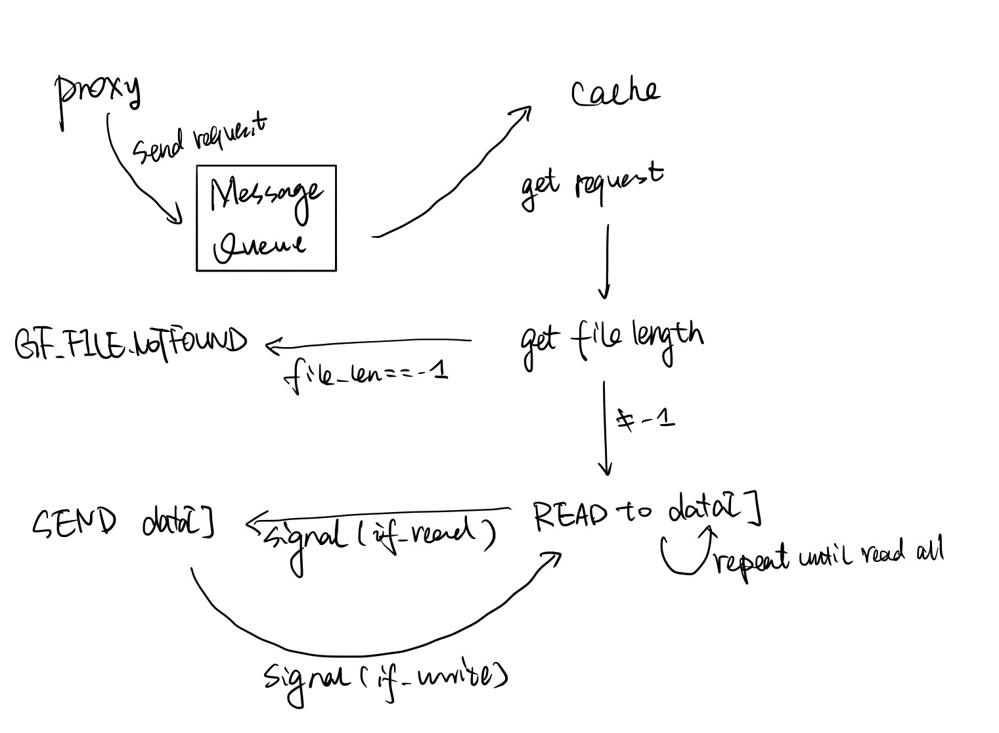

# Project README file

## Project Description

Your README file is your opportunity to demonstrate to us that you understand the project.  Ideally, this
should be a guide that someone not familiar with the project could pick up and read and understand
what you did, and why you did it.

Specifically, we will evaluate your submission based upon:

- Your project design.  Pictures are particularly helpful here.
- Your explanation of the trade-offs that you considered, the choices you made, and _why_ you made those choices.
- A description of the flow of control within your submission. Pictures are helpful here.
- How you implemented your code. This should be a high level description, not a rehash of your code.
- How you _tested_ your code.  Remember, Bonnie isn't a test suite.  Tell us about the tests you developed.
  Explain any tests you _used_ but did not develop.
- References: this should be every bit of code that you used but did not write.  If you copy code from
  one part of the project to another, we expect you to document it. If you _read_ anything that helped you
  in your work, tell us what it was.  If you referred to someone else's code, you should tell us here.
  Thus, this would include articles on Stack Overflow, any repositories you referenced on github.com, any
  books you used, any manual pages you consulted.


In addition, you have an opportunity to earn extra credit.  To do so, we want to see something that
adds value to the project.  Observing that there is a problem or issue _is not enough_.  We want
something that is easily actioned.  Examples of this include:

- Suggestions for additional tests, along with an explanation of _how_ you envision it being tested
- Suggested revisions to the instructions, code, comments, etc.  It's not enough to say "I found
  this confusing" - we want you to tell us what you would have said _instead_.

While we do award extra credit, we do so sparingly.


## Part 1

In this part, I mainly use the [Libcurl Code Example](https://www.hackthissite.org/articles/read/1078) and `handle_with_file`.

1. Init the CURL and perform
2. Check the curl response code
   - 200: `gfs_sendheader(ctx, GF_OK, chunk.size)` and send the buffer content
   - 404 or 403: `gfs_sendheader(ctx, GF_FILE_NOT_FOUND, 0);`
   - Other: `gfs_sendheader(ctx, GF_ERROR, 0);`
3. Clean up the curl and free all memory

#### Test in local

Open two terminal:

1. `./gfclient_download -p 19121`
2. After change `char* data_dir = "s3.amazonaws.com/content.udacity-data.com";`, run `./webproxy`

## Part 2

#### Test in local

Open three terminal in local and use

```
./webproxy
./simplecached
./gfclient_measure -p 19121
```


#### Design for Request Channel

Here, I choose message queue. In order to satisfy "Neither the cache daemon nor the proxy should crash if the other process is not started already, ", both message queue in `handle_with_cache.c` and `simplecached.c`is inited using code `msgid = msgget((key_t)1234321666666, 0666|IPC_CREAT);`.


The process is like the image above. Firstly, `handle_with_cache` send the message to message queue and `simplecached`receive the message from queue. The structure of message is:

```
// define in shm_channel.h
typedef struct request_cmd
{	
	int shmid;
	size_t segsize;
	char path[444];
}request_cmd;

typedef struct command_msg
{
	long int msg_type;
	request_cmd req;
}command_msg; 
```

Only `shmid`,`segsize` and file path is communicated by message queue. Once both side have same `shmid`, then others are handled using shared memory.

#### Design for Data Channel

The data channel is implemented using shared memory as required. I firstly init a `steque_t Q`and push `nsegments` of `shmid` in it(`key` here is generated randomly). When requesting a file from cache, `handle_with_cache` pop one `shmid` and use that to get the file.  Synchronization is designed here firstly for the `steque_t Q`.  Mutex`mQ` is locked enqueue and push. Also, when the `shmid` is runned out, other request need to wait for the condition `pthread_cond_t available_Q`.

Synchronization is also designed between the communication of `handle_with_cache` and `simplecaced`.  The structure of shared memory is:

```
typedef struct shared_use_st
{
    int readORwrite; // 0: write not 0: read
    pthread_mutex_t mShare;
    pthread_cond_t if_write;
    pthread_cond_t if_read;
    ssize_t file_len, read_len;    
    char data[];
}shared_use_st;
```

`pthrad_mutex_t mShare`is to ensure that only one thread handle one request. Two conditions `if_write`and `if_read` is used to know when `handle_with_cache`read and when cache write. The `read_len` is the length cache read to `data[]`. It is needed to let `handle_with_cache`process know and transfer that length of data.

#### The process of whole channel for one request



## References

- [Libcurl Code Example](https://www.hackthissite.org/articles/read/1078)
- [Linux IPC(6): Shared memory](https://www.cnblogs.com/52php/p/5861372.html)
- [Linux IPC(7): Message queue](https://www.cnblogs.com/52php/p/5862114.html)
- [Geeksforgeeks: Message queue](https://www.geeksforgeeks.org/ipc-using-message-queues/)